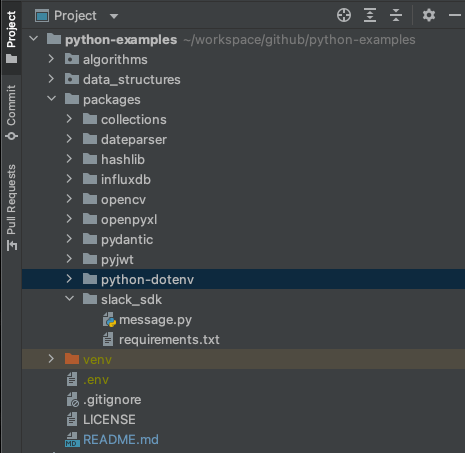

# python-dotenv
- [github page](https://github.com/theskumar/python-dotenv)

## tested environments
- os : macOS v12.6
- python : 3.9.12
- python-dotenv: v0.20.0


## install
```bash
pip install python-dotenv
```


## run

Please create an .env file in the root directory of your project.



And then write your configuration inside the .env file.
For example,

```
username=[USERNAME]
password=[PASSWORD]
```

And run dotenv.py!
```shell
$ python load_envs.py
```

You can see the result like below.
```shell
[USERNAME]
[PASSWORD]
```
